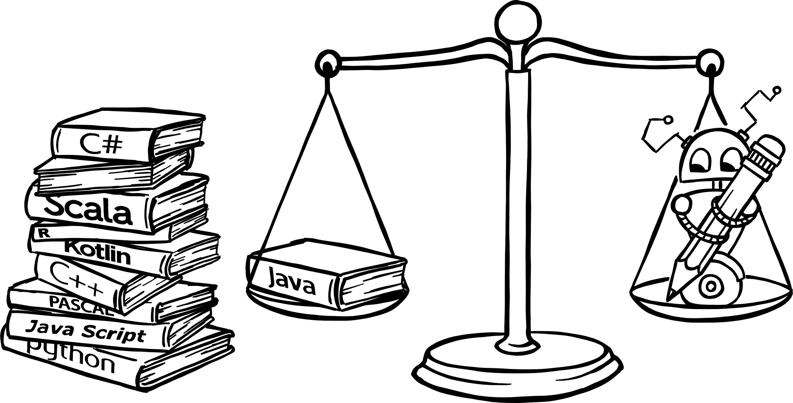

<!-- BEGIN TITLE -->
# Is x a more powerful programming language than y?
<!-- END TITLE -->

<!-- BEGIN BODY -->
There are hundreds or even thousands of programming languages, but are all of these equally powerful, i.e. can they be used to compute an arbitrary problem? Yes, if they are Turing complete.

A programming language is called Turing complete if it can be used to simulate a Turing machine. Since a Turing machine is defined as to be able to compute everything computable, all Turing complete languages are all equally powerful.

Most of the commonly used programming languages are Turing complete. But there are some well-known domain specific languages that are not. However, Turing completeness says nothing regarding the performance or the ease of use.
<!-- END BODY -->

## Optional text
<!-- BEGIN OPTIONAL -->
There are examples of one-instruction languages that are Turing complete, for example the x86 mov operator.
<!-- END OPTIONAL -->

## Author
<!-- BEGIN AUTHOR -->
Marco Vogt
<!-- END AUTHOR -->
