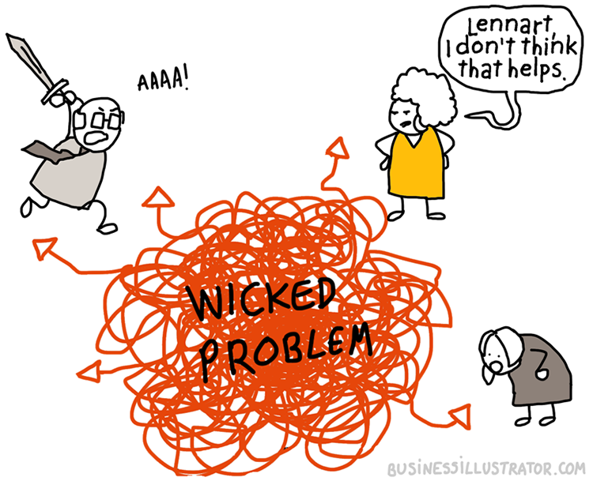

<!-- BEGIN TITLE -->
# Gaining from Unsolvable Problems
<!-- END TITLE -->

<!-- BEGIN BODY -->
In our everyday lives, we encounter various challenges. Some can be solved by computers in a reasonable amount of time, like sorting our emails or finding the fastest route on a map, while others, such as predicting complex weather patterns or solving certain mathematical problems, cannot be computed efficiently.

At first glance, it might seem disappointing that not everything can be computed. However, this limitation presents an opportunity. If we can design problems that no computer can solve in a reasonable time, we can create a framework for our security. All cryptographic algorithms rely on such problems, where retrieving the unencrypted message is impossible without the secret key.
<!-- END BODY -->

## Author
<!-- BEGIN AUTHOR -->
Ali Ajorian
<!-- END AUTHOR -->
