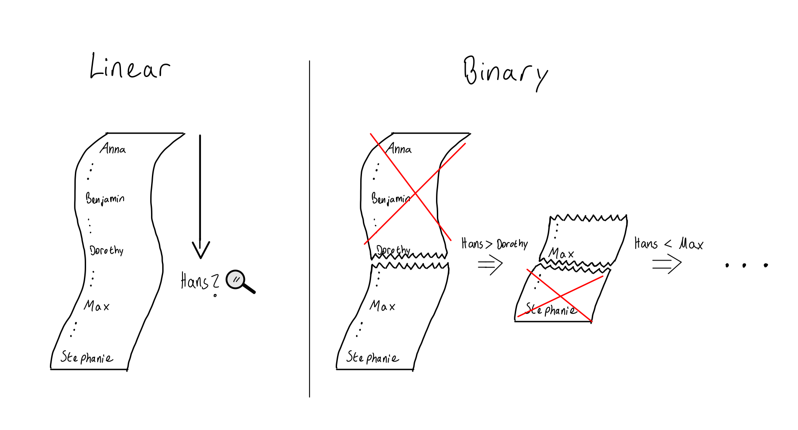

<!-- BEGIN TITLE -->
# Search Smarter Not Harder
<!-- END TITLE -->

<!-- BEGIN BODY -->
What would you do, if you are given a list of sorted entries and asked to find a particular one? 
You could read through the list, until you find the correct entry. 
However, if the list has one million entries, you might have to read all of them until you find what you are looking for!

What if you skipped to the middle of the list and answered the following question: 
"Does the entry I am looking for belong in the first or second half of the list?"
Whatever the answer, you now only have to consider 500 000 entries.
By repeating this process, you can halve the number of possible entries again.
If you keep doing this, you will have to read at most $log_2(1000000) \approx 20$ entries!

Computer Scientists call the first approach "linear search" and the second "binary search". Formally the runtimes (how many entries you have to read) are $O(n)$ and  $O(log(n))$, where $n$ is the number of entries. 
<!-- END BODY -->

<!-- BEGIN AUTHOR -->
Carina Schrenk
Philippe Leon-Marius Gottfrois 
<!-- END AUTHOR -->

