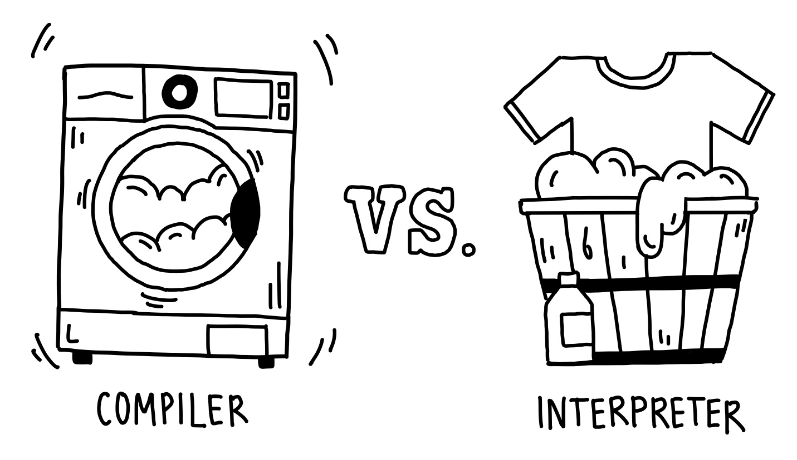

<!-- BEGIN TITLE -->
# "Compilers vs. Interpreters: Two Ways To Run Code!"
<!-- END TITLE -->

<!-- BEGIN BODY -->
Before we can run our JavaScript or C++ code on the computer, it first needs to be translated into machine code. This is where, depending on the language used, compilers and interpreters come into play:

**Compilers** take the entire code (e.g., in C++) and convert it into machine code **all at once** before running the program. This means that once the code is compiled, the computer can run it directly. While compiled programs tend to run fast, they need to be recompiled each time changes are made to the code.

**Interpreters**, on the other hand, translate and run the code (e.g., in JavaScript) **line by line**. This makes it very easy to test code quickly, but it can be slower than compiled code because the translation happens during execution.

We can compare this to doing laundry: a compiler is like using a washing machine, handling all the clothes at once, while an interpreter is like washing clothes by hand, one piece at a time.
<!-- END BODY -->

## Authors
<!-- BEGIN AUTHOR -->
Evrim Firatli & André Vieira Ribeiro
<!-- END AUTHOR -->

