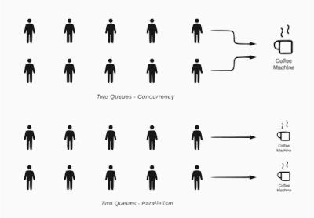

# Concurrency and Parallelism

Think of a café and customers are ordering coffee. You have several tasks to handle: grinding coffee beans, brewing espresso, and steaming milk. Let’s see how you manage these tasks:

- Concurrency is when you overlap multiple things at a time. You start grinding the beans, pause to brew the espresso, then steam the milk, and finally return to grind more beans. You’re working on multiple tasks, but only one at a time, switching between them to get everything done.

- Parallelism is like having a team of baristas. One grinds the coffee, another brews the espresso, and a third steams the milk—all happening at the same time.

.

