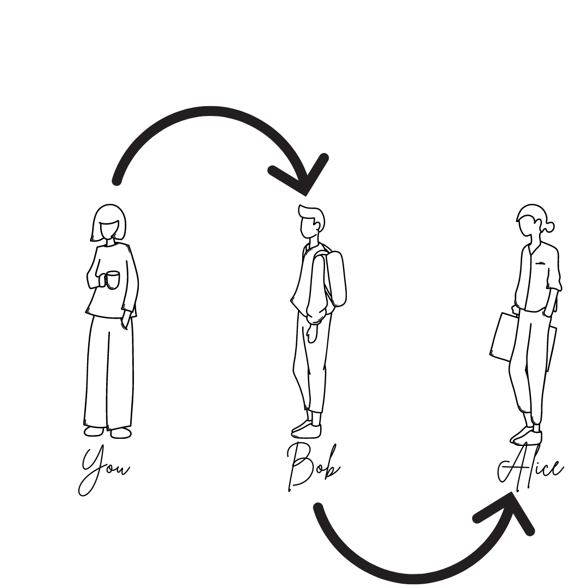

## I Know a Guy Who Knows Someone: How Proxies Work

So imagine you have a friend named Bob, and he knows someone named Alice, but you need to communicate with Alice. So, you just send a message to Bob, and he forwards it to Alice. When Alice wants to communicate back, she sends her message to Bob, and he passes it back to you. This is basically how a proxy works. Proxies provide a layer of protection, hiding your real location and helping to keep your identity and personal data safe while you're browsing the internet. Since you're using Bob, the proxy, to communicate, the website only sees Bob, not you.

Proxies can also be used to access geo-restricted content and help you to browse faster because Bob, the proxy, might already have a copy of the website you're visiting, so he can send it to you quickly. However, even though proxies offer some level of privacy, they don't keep you fully anonymous. Unlike a VPN, proxies don't encrypt the data you send. But the advantage is that a proxy doesn’t slow down your connection as much as a VPN does.

## Author
Ashwin Vazhappilly and Likhitha Vutukuri