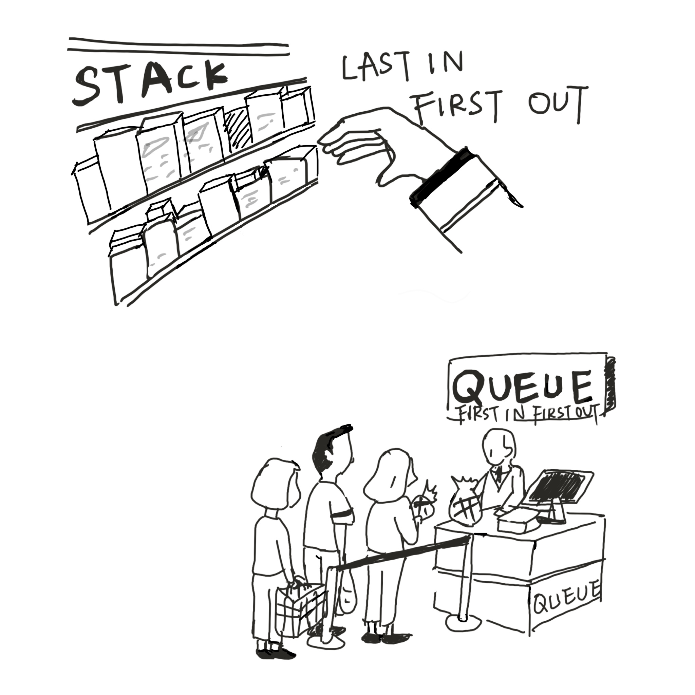

<!-- BEGIN TITLE -->
## What Supermarkets Can Teach Us About Data Structure?
<!-- END TITLE -->

<!-- BEGIN BODY -->
Imagine in a supermarket. When restocking, The employee usually places new items at the front of the existing ones. Customers typically take items from the outermost position. In this way, the most recently added products are the first to be purchased. In computer science, this is called **'stacks'** , following the "Last In, First Out" (LIFO) principle.

Customers waiting to pay for their groceries form a line, where the first customer to join is the first to be served. After completing their payment, the next one in line moves forward. New customers always join the back of the line, ensuring that the checkout process is orderly. In computer science, this is called **'queues'**, following the 'First In, First Out' (FIFO) principle.

Programmers do this as well, queues and stacks are simple yet powerful tools in the their toolkit. They help organize data efficiently, ensuring that tasks are handled either in the order they arrive (queues) or in reverse order of their addition (stacks).
<!-- END BODY -->

## Author
<!-- BEGIN AUTHOR -->
Jue Du and Chengrui Liu
<!-- END AUTHOR -->
