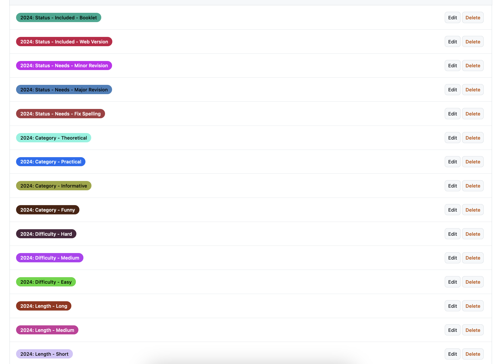

# Things I Learned in Computer Science (tilics)

This is the collaborative repository for seminar
[54858-01](https://vorlesungsverzeichnis.unibas.ch/de/home?id=286129) in fall 2024.

See the directory [2019](/2019/) for the content produced by the same seminar in spring 2019. The result of that seminar is available on the Department's web site at [https://tilics.dmi.unibas.ch/start](https://tilics.dmi.unibas.ch/start).

---

## TILICS 2024

This is the organisation space for 2024 seminar course.

### Repository Structure

- [Task Force 2024](/admin/taskforces_2024.md)
- Use [GitHub Discussion](https://github.com/unibas-tilics/tilics/discussions) for organisational matter.
  
    > You can tag people to notify them to participate in discussion.

###  For Authors

#### How to create pull request?
##### Step 1 : Clone the repository
Clone the repository to your local machine :

```
git clone https://github.com/unibas-tilics/tilics.git
```

##### Step 2 : Create a new branch

 Run the following command to create and switch to a new branch : 

```
git checkout -b <new-branch-name>
```

##### Step 3 : Add your article

Create a folder in the `2024` directory.  The name of the folder follows the pattern: `topic-name`, such as `rices-theorem`.

Then create a Markdown file `article.md`. Please use the template below and keep the `<!-- BEGIN ... -->` and `<!-- END ... -->` lines intact; they are required for making the document more machine-readable.

   ```markdown
<!-- BEGIN TITLE -->
# Put your title here, including the leading pound sign
<!-- END TITLE -->

<!-- BEGIN BODY -->
Put your article's text in Markdown here.
<!-- END BODY -->

## Optional text
<!-- BEGIN OPTIONAL -->
If your article has some optional text, add it here.
<!-- END OPTIONAL -->


## Author
<!-- BEGIN AUTHOR -->
Put your name (and only your name) here.
<!-- END AUTHOR -->
   ```

Please put your illustration for the artist(s) to the same directory.

Commit and push to your previously created branch.

##### Step 4 : Open a pull request

Create a pull request from your branch against the `master` branch.  Therefore, please click on "New pull request" and add the description of the pull request.

Here is a reference video. You can click the link and then click "View raw" to download it.
[pull-recreat-video](./create-pull-request.mp4)


### For Quality Team

#### How to use labels for tagging?

```markdown
##### Step 1: Go to the Pull Request
- Click on the "Pull requests" tab at the top of the page.
- Select the specific pull request you want to review.

##### Step 2: Locate the Labels Section
- On the right-hand side of the pull request page, you will see a section labeled **Labels**.

    Add a Label:
    - Click on the **Labels** dropdown.
    - A list of available labels will appear. You can choose the appropriate label.
    - Click on the desired label(s) to apply them to the pull request.
    
    Confirm the Label:
    - Once the label(s) is added, it will appear on the right side of the pull request, indicating that the label has been successfully applied.
    
```

Currently available labels are as follows:



#### How to merge pull request?

```markdown
##### Step 1 : Review
In order to be merged, the pull request requires two approvals from the Quality Team.
Reviewers can add comments in the pull request's comment thread if something should be changed.  When editing your article, simply commit and push the changes to your branch; they are automatically added to the pull request.
##### Step 2 : Merge
If everything is ok, the pull request can be merged.  Be sure to
choose the `Squash and Merge` merge option.
```

