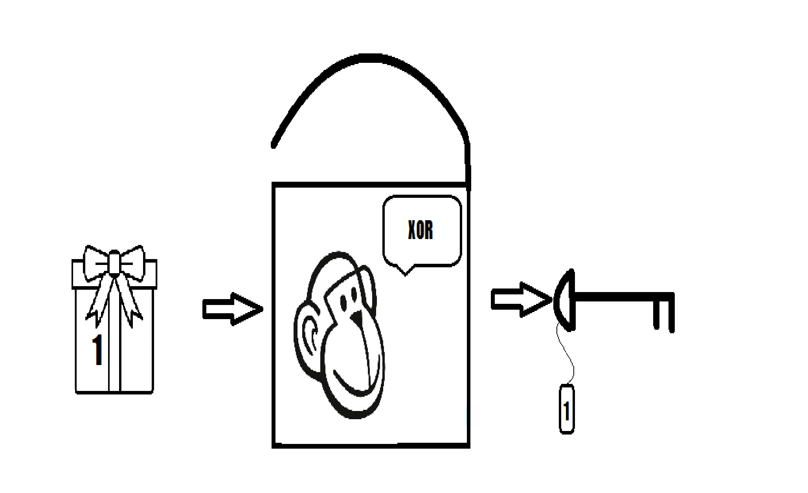

# Cryptographic hashing

Cryptographic hashing is the process of creating a unique "fingerprint" of data. This hash converts a large amount of information into short characters. It is impossible to convert the hash back to the original data. Even a small change in the data completely changes the hash, which ensures uniqueness. 
The resulting hashing algorithms are different (for example, SHA-256, MD5), they differ in complexity and speed of operation. The more bits in the hash, the more difficult it is to crack, but the hashing process becomes slower.
 

 
