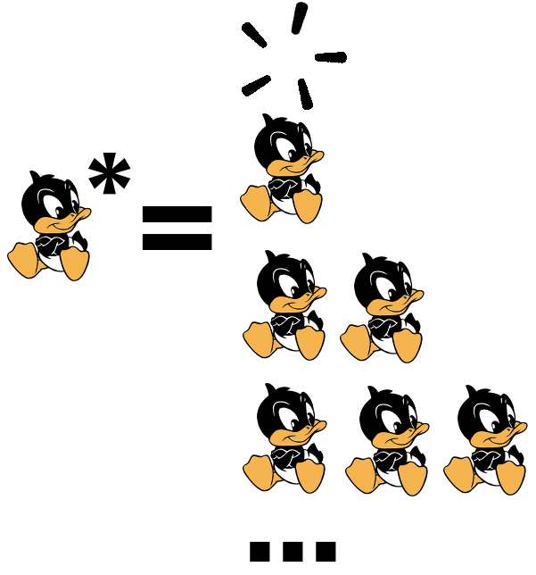

<!-- BEGIN TITLE -->
# Kleene's Star is not Blah Blah
<!-- END TITLE -->

<!-- BEGIN BODY -->

Computers are great at repetitive tasks. The most beautiful and concise
way of expressing repetition is Kleene's star, namely the symbol "*" which
stands for **zero or more repetitions**.

For example, in Computer Science theory, the letter A followed by the
Kleene Star, __"A*"__, either means
* '' (the word of length 0), or
* 'A' (the word consisting of one A), or
* 'AA' (the word consisting of exactly two As),
* etc

A related but different concept is a _wildcard_ where the star is a
placeholder (instead of a sign of repetition). For example "*.txt"
selects files that end in "txt". Kleene's star is not common in
daily life, but wildcards are: A prominent example is "blah blah".

<!-- END BODY -->

Image: use a bath duck

## Author
<!-- BEGIN AUTHOR -->
cft, 2019-02-26
<!-- END AUTHOR -->

## Author
