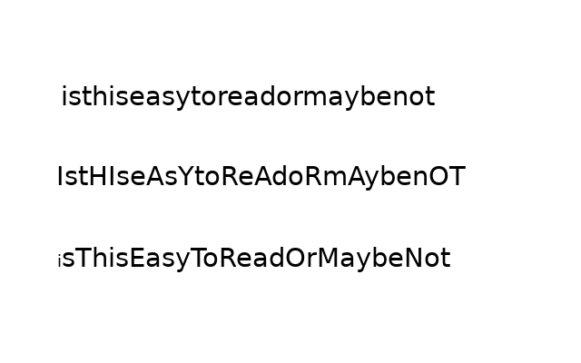

<!-- BEGIN TITLE -->
# CamelCase, or why coding conventions matter
<!-- END TITLE -->

<!-- BEGIN BODY -->
In software development, it's important to keep your code in a consistent style, especially if multiple people work on the same code.
That's why most programmers and teams use coding conventions. There are different conventions for each programming language but their goal is always to give the code a cleaner and more structured look and to increas readability.

One problem that often arises when writing code is the name of variables. Often multi-word names are used for variables but in most programming languages it is not possible to use spaces in a variable name. One programming style that tries to structure this is called CamelCase. It is the practice of writing each word in the middle of a phrase with a capital letter. This greatly improves readability.
<!-- END BODY -->

 

## Optional text
<!-- BEGIN OPTIONAL -->
I could mention other styles like in Python, hello_world
<!-- END OPTIONAL -->

## Author
<!-- BEGIN AUTHOR -->
Linard Schwendener
<!-- END AUTHOR -->