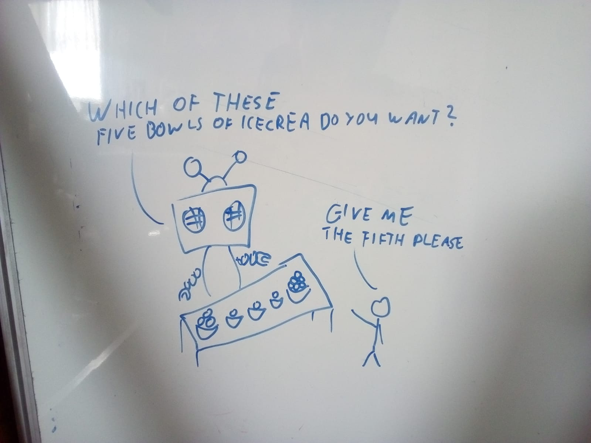

<!-- BEGIN TITLE -->
# “Should array indices start at 0 or 1? My compromise of 0.5 was rejected without, I thought, proper consideration.” 
-Stan Kelly-Bootle
<!-- END TITLE -->

<!-- BEGIN BODY -->
An array is a data structure to store some elements with an index for each. 
This coins the question: 'what is the smallest index?'

Most programming languages start an array at index 0 but there are some rare outliers that start with index 1. 

If you want to figure out whether the person in front of you is a computer scientist or not, there is one easy way to find it out: 
Show a bunch of things an let him count them. The true computer scientist will start to count with a zero.

<!-- END BODY -->

## Optional text
<!-- BEGIN OPTIONAL -->

<!-- END OPTIONAL -->

## Author
<!-- BEGIN AUTHOR -->
Rebecca Dold & Simon Dold
<!-- END AUTHOR -->
