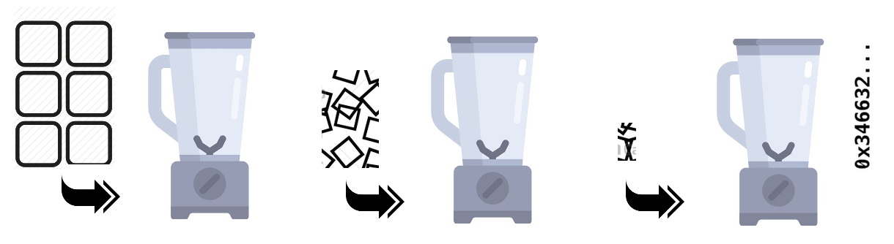

<!-- BEGIN TITLE -->
# Mincing Bytes (or the Art of Hashing)
<!-- END TITLE -->

<!-- BEGIN BODY -->

By meticulously mincing and blending a file's bytes several time one
can extract a byte pattern --called a hash value-- that is for all
practical purposes unique to that file.

What makes a good hashing function is not fully understand, though,
and a final theory of hashing is still pending - so it's really an
art! But one can not understate the importance of hash functions for
cryptographc algorithms and for efficient data management.

<!-- END BODY -->

## Author
<!-- BEGIN AUTHOR -->
cft
<!-- END AUTHOR -->
