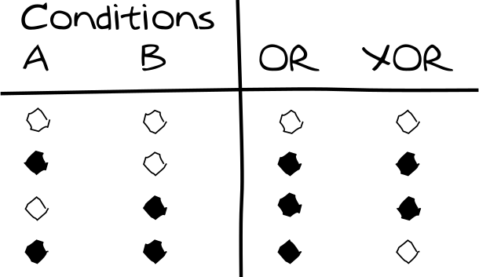

<!-- BEGIN TITLE -->
# There are two different kinds of OR
<!-- END TITLE -->

<!-- BEGIN BODY -->
The question whether a "or" can be interpreted as an "and" is a common sense of confusion. While as humans we can often resolve this confusion by looking at the context, computers require a strict definition.

In mathematical logic, the foundation of Computer Science, it is therefore distinguished between "or" and "exclusive or". The latter is often abbreviated as XOR. In English, we can express a XOR by using an either … or construction.

The OR operator is always defined as an "and/or". It is fulfilled if at least one of its conditions is fulfilled. It is therefore also called "inclusive or". An exclusive or on the other hand is fulfilled if (and only if) exactly one of the conditions is fulfilled. If both of its conditions are met, the exclusive or is no longer fulfilled.
<!-- END BODY -->

 

 

## Optional text
<!-- BEGIN OPTIONAL -->
While it is crucial for computer systems to rely on a clearly defined set of operators, the authors believe that human languages would also benefit from more precise terms.
<!-- END OPTIONAL -->

## Author
<!-- BEGIN AUTHOR -->
Marco Vogt
<!-- END AUTHOR -->
