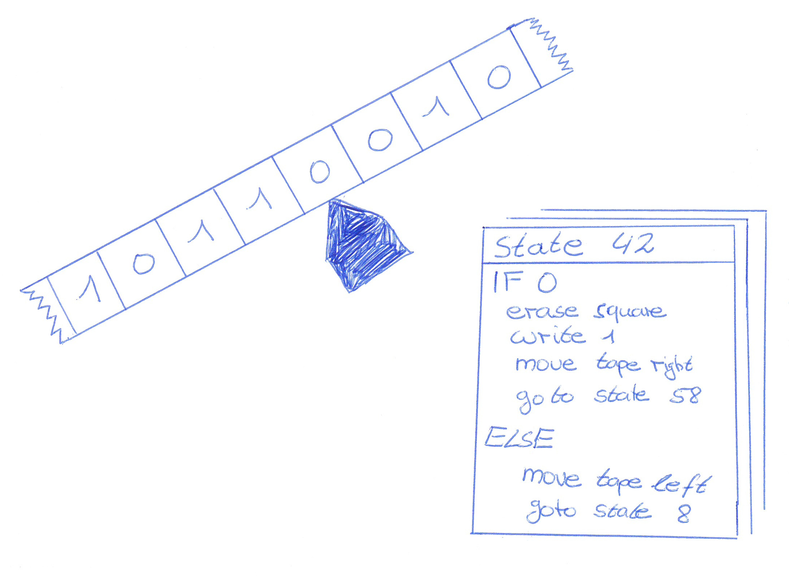

<!-- BEGIN TITLE -->
# The Essence of Computation: The Turing Machine
<!-- END TITLE -->

<!-- BEGIN BODY -->
The Turing machine is an imaginary model of a machine which describes what can computed by following an algorithm. This machine can write down information in a coded form on a tape. This tape is divided into squares. Each of these squares contains either a 0 or a 1. 

The Turing machine itself is a state machine that reads the content of the currently selected square and executes the algorithm associated with its current state. Every possible state of the Turing machine has an algorithm associated. The machine can, depending on the algorithm, modify the content of a square and move the tape to the left or the right.

The machine starts with a bunch of algorithms and a tape containing the input parameters encoded as 0s and 1s and ends with the result of the computation encoded as 0s and 1s. While the computation is running (the machine is working), the tape is continuously modified.

The Turing machine is a quite simple concept but it turns out, it contains the essence of computation: Every problem that can be computed, can theoretically also be computed by a Turing machine. This makes the Turing machine an important concept in theoretical computer science.
<!-- END BODY -->

## Optional text
<!-- BEGIN OPTIONAL -->
The Turing machine is named after its inventor Alan Turing who introduced this conceptual model in 1936.
<!-- END OPTIONAL -->

## Author
<!-- BEGIN AUTHOR -->
Marco Vogt
<!-- END AUTHOR -->