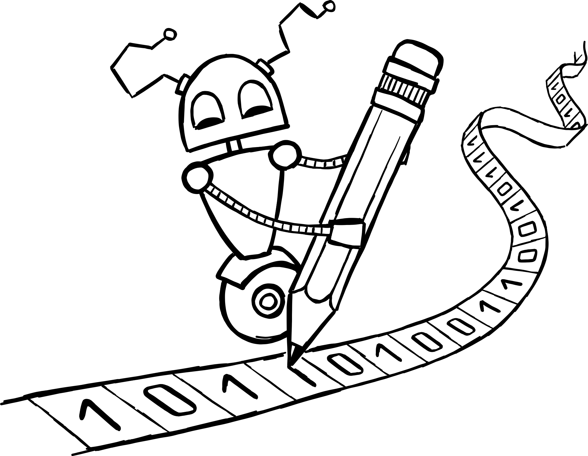

<!-- BEGIN TITLE -->
# The Essence of Computation: The Turing Machine
<!-- END TITLE -->

<!-- BEGIN BODY -->
The Turing machine is an imaginary model of a machine. It describes what can be computed by following an algorithm. It prints information in a coded form on a tape. This tape is divided into squares. Each of these squares contains either a 0 or a 1.

As a state machine, the Turing machine reads the content of the currently selected square and executes the algorithm associated with its current state. Every possible state of the Turing machine has an algorithm associated with it. Depending on the algorithm, the machine modifies the content of a square and moves the tape to the left or the right.

The Turing machine is a quite simple concept, but it contains the essence of computation: Every problem that can be computed, can theoretically also be computed by a Turing machine. This makes the Turing machine an important concept in theoretical computer science.
<!-- END BODY -->

## Optional text
<!-- BEGIN OPTIONAL -->
The Turing machine is named after its inventor Alan Turing who introduced this conceptual model in 1936.
<!-- END OPTIONAL -->

## Author
<!-- BEGIN AUTHOR -->
Marco Vogt
<!-- END AUTHOR -->
