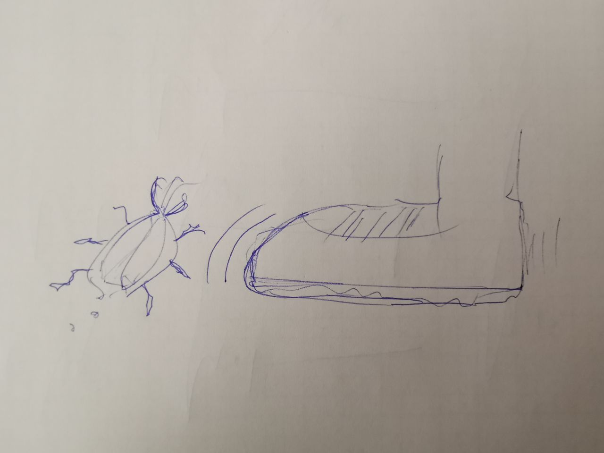

<!-- BEGIN TITLE -->
# We all hate Bugs
<!-- END TITLE -->

<!-- BEGIN BODY -->
Bugs are something nobody wants. They creep into your house or your code without notice. There they eat your resources and clog your sink. 
They hide in corners and behind large furniture and are most of the times hard to find. But whether in the household or in the software code, if you find a bug that was bothering you for a long time the feeling of success is rewarding.
A bug in software is usually a behavior of the software which is not intended. Sometimes they are very hard to find and can be attributed to one single character that was wrongly placed. Other times they are structural mistakes that lead to a "bridge collapse". The act of finding bugs is called Debugging. Like pest control, the code is searched and cleaned from every bug that would influence the behavior of the software in a negative way.
Often while fixing software bugs the programmer accidentally adds another bug. The cicle is endless.
<!-- END BODY -->

## Optional
<!-- BEGIN OPTIONAL -->
Some People say they spend more then 50% of their work with debugging.
<!-- END OPTIONAL -->

## Author
<!-- BEGIN AUTHOR -->
Linard Schwendener
<!-- END AUTHOR -->
