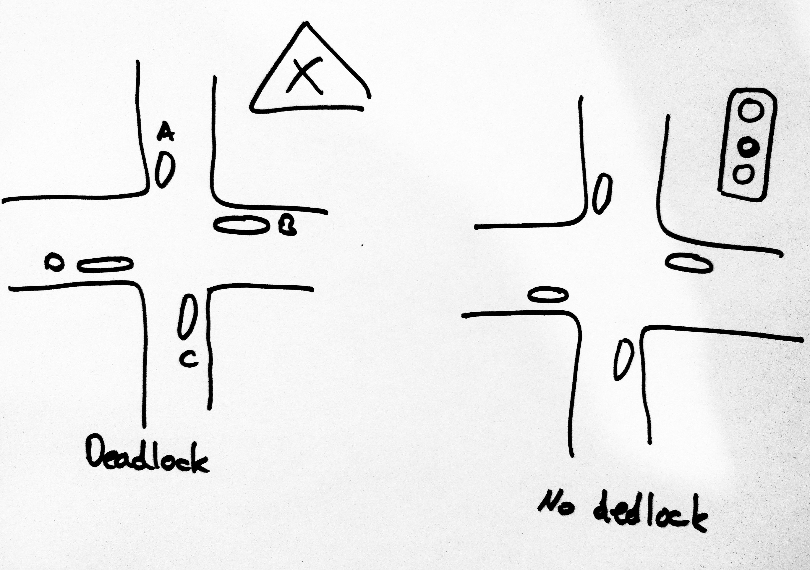

<!-- BEGIN TITLE -->
# Deadlock
<!-- END TITLE -->

<!-- BEGIN BODY -->
Imagine an uncontrolled intersection without any traffic signs. Here, drivers have to respect the priority to the right system. In the situation shown in the left picture, none of the cars can continue. In practice this is solved by one driver giving up their priority using a hand-sign.

A similar situation can occur when several computer processes running in parallell want to access shared resources. In a *circular wait* scenario, processes block each other from continuing execution as they wait for a resource held by one of their peers. 

Since computer processes cannot hand wave at ech other, clear rules are needed to avoid this situation in the first place. One solution is to order the resources by giving them a unique number. Processes would only be allowed to access them by increasing order of numbering. Another possibility is to introduce a central governor that needs to give its permission before a process can access a resource. This is equivalent to placing traffic lights at an intersection. 
<!-- END BODY -->

## Optional text
<!-- BEGIN OPTIONAL -->
<!-- END OPTIONAL -->

## Author
<!-- BEGIN AUTHOR -->
Patrick Kahr
<!-- END AUTHOR -->
