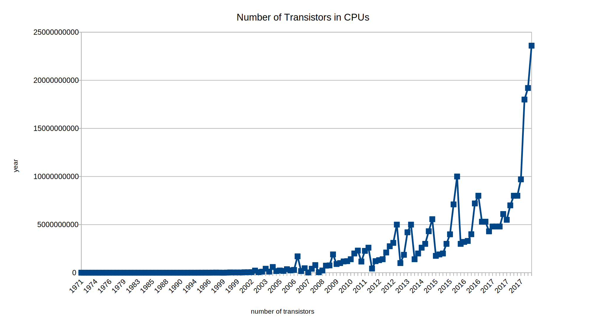

<!-- BEGIN TITLE -->
# Moore's Law
<!-- END TITLE -->

<!-- BEGIN BODY -->
The technological progress at that time lead Gordon E. Moore, in 1965, to formulate his rule of thumb that became famous under the name "Moore's Law". It states that the production costs of microchips used in electronic circuits would fall, leading to denser and more powerful microchips at a lower overall cost. He estimated, the number of components on a single chip to double roughly every 12 months until 1975.

This law has been updated several times over the following decades. First the increase in the number of transistors used in a single chip was the driving force behind the exponential progress. Since the mid-1990s, and until the early 2000s, the continuation of the trend was mostly due to the downscaling of the components themselves. Today, as the manufacturing process is hitting physical limits, there is a development towards integrating functions, that until now were provided by separate components, into a single chip.

<!-- END BODY -->

## Optional text
<!-- BEGIN OPTIONAL -->
Moore's Law does not only apply to the number of transistors in computer processors, but also extends to other technologies such as hard drive capacity. 
<!-- END OPTIONAL -->

## Author
<!-- BEGIN AUTHOR -->
Patrick Kahr
<!-- END AUTHOR -->
