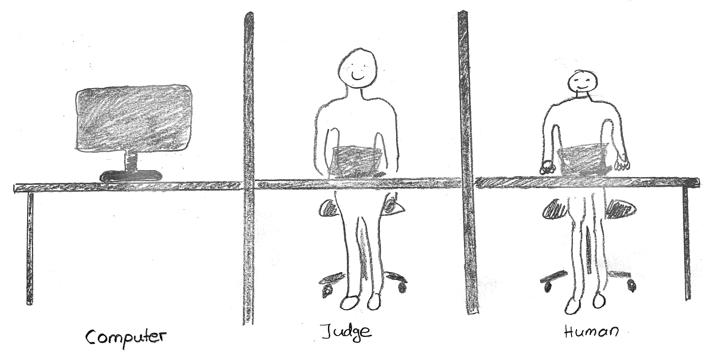

<!-- BEGIN TITLE -->
# Can a computer talk like a human?
<!-- END TITLE -->

<!-- BEGIN BODY -->
Are you sure it is a human answering your question in the chat support of your favorite online store? If not, how you find out? What sounds like an easy question turns out to be rather difficult. 

In 1950, a long time before the first online stores opened, the computer science pioneer Alan Turing already thought about this problem and presented the Turing test. The test is passed if a human judge interviewing a human and a machine is unable to distinguish between them based on their answers. The first program that managed convince some of the judges was ELIZA. It managed to mimic a psychotherapist by reflecting the questions back to the questioner. While there have been several promising attempts in the recent years, yet no program managed to fully pass the test.

However, the next time someone in the chat support of your ISP tries to calm you down--ask yourself: Am I talking with a human?
<!-- END BODY -->

## Comment
Weather ELIZA was able to pass the Turing test is highly contentious. 

## Author
<!-- BEGIN AUTHOR -->
Marco Vogt
<!-- END AUTHOR -->
