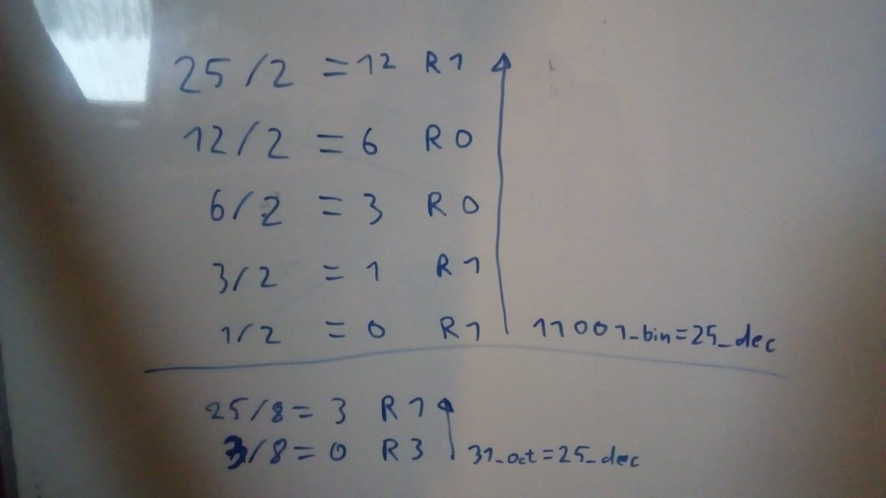

<!-- BEGIN TITLE -->
# why does the computer scientist confuse halloween and christmas? Because 25_dec= 31_oct
<!-- END TITLE -->

<!-- BEGIN BODY -->
A computer stores everything with 1s and 0s. To encode any number as a String of 1s and 0s you use the binary system. It is similar to the deciaml system normal humans use but it has only two figures 1 and 0. In decimal you have the base 10 and can rewrite the number 1337_dec as 1*10^3+3*10^2+3*10^1+7*10^0. In binary the number 1101_bin can be representet as 1*2^3+1*2^2+0*2^1+1*2^0=13_dec. the are also other systems like hexadecimal with the 16 figures 0,1,2,3,4,5,6,7,8,9,A,B,C,E,F and the octal system with the figures from 0 to 7. To get from one system to the other you devide by the base with remainder until you reach 0. Then you string the remainders backwards together. 
<!-- END BODY -->

## Optional text
<!-- BEGIN OPTIONAL -->
Don't worry. The 101 in the title was in decimal. We are not done yet.
<!-- END OPTIONAL -->

## Author
<!-- BEGIN AUTHOR -->
Rebecca Dold and Simon Dold
<!-- END AUTHOR -->
