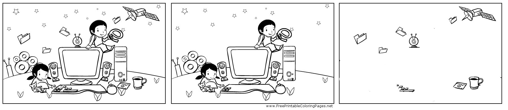

<!-- BEGIN TITLE -->
# Why Patching is like Picture Puzzles
<!-- END TITLE -->

<!-- BEGIN BODY -->
If you have a buggy version of a program and a corrected one: why
send the whole program instead of just the small differences?

This is how updates for your smartphone work: you will receive the
set of differences --a so called _patch_-- that your smartphone applies
to the old and buggy program.

Now go and find the differences: Did we spot them all?
<!-- END BODY -->

## Author
<!-- BEGIN AUTHOR -->
cft
<!-- END AUTHOR -->
