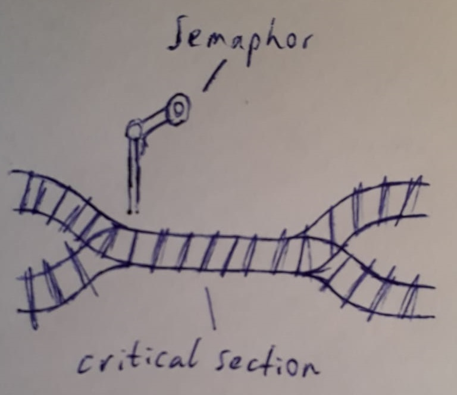

<!-- BEGIN TITLE -->
# Mutex
<!-- END TITLE -->

<!-- BEGIN BODY -->
Imagine a railway intersection where only one train can pass at a time. If any other train tries to pass the intersection while it's already being used, a crash happens.

The same thing can happen in a computer, where we might think that all things happen ordered and sequentially. But in a world where everything is parallelized this can not be guaranteed and as soon as a file gets changed and read at the same time, things can go wrong.

Similar to a light signal for the railway intersection which would only allow one train to pass at a time, computers have something called *mutexes*. These are essentially *locks* that only ever allow one source to access a critical section, everyone else has to wait, thus preventing any unintended behavior or crashes.
<!-- END BODY -->

## Optional text
<!-- BEGIN OPTIONAL -->
<!-- END OPTIONAL -->

## Author
<!-- BEGIN AUTHOR -->
Nils Bühlmann
<!-- END AUTHOR -->