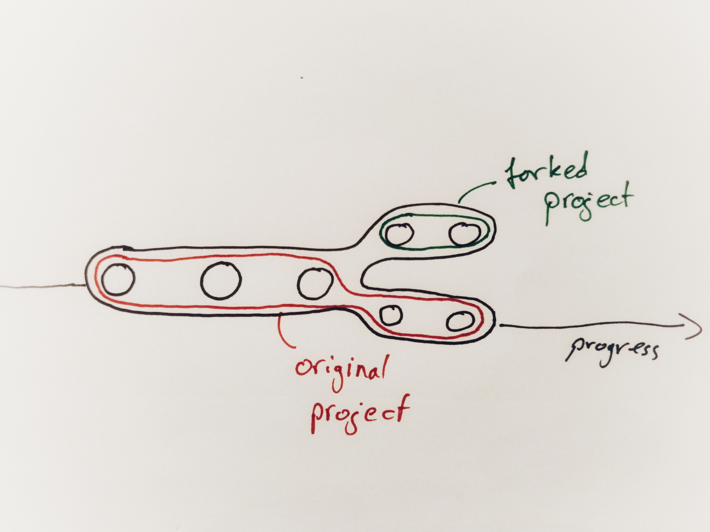

<!-- BEGIN TITLE -->
# Why do programmers need forks?
<!-- END TITLE -->

<!-- BEGIN BODY -->
Software development is a continuous process. Programmers, engineers, and users, work together to improve the current version of a software. 

In open-source projects, the source code of the software is openly available. Everyone can look at it and submit their own contributions. Usually, software projects are happy to receive feedback from the community. 

Sometimes, the suggested changes deviate too much from the goal of the project. Developers can then decide to copy the source code and start a new independent project. This deviation from the original project is also called a "fork".
<!-- END BODY --> 

 

 

## Author
<!-- BEGIN AUTHOR -->
Patrick Kahr
<!-- END AUTHOR -->
