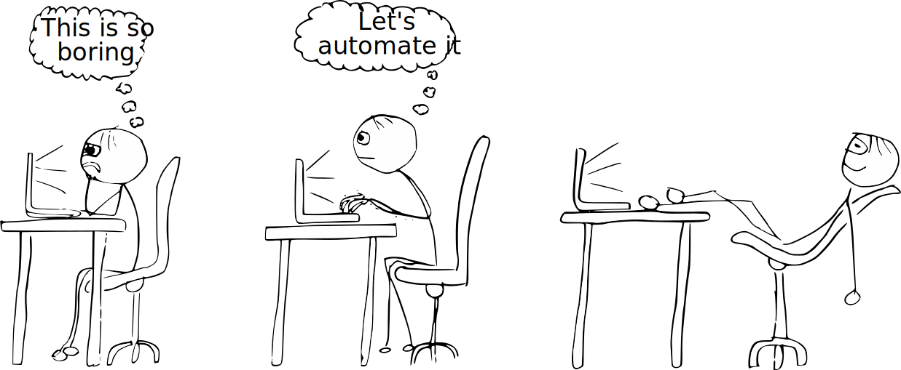

<!-- BEGIN TITLE -->
# Being lazy is a good thing
<!-- END TITLE -->

<!-- BEGIN BODY -->
A lazy person is always searching for ways to make things faster and more efficient. 

Instead of doing the same thing over and over again, a good computer scientist tries to automate the task. This not only improves the reliability, but also saves time in the long run. Furthermore, a good computer scientist is also lazy when it comes to writing code. Rather than solving a specific problem, a good programmer develops a generic solution that can be reused for similar problems. 

Good programmers are diligent in order to be lazy. Or with other words: They are strategically lazy. And that's a good thing.   
<!-- END BODY -->

 

 

## Author
<!-- BEGIN AUTHOR -->
Marco Vogt
<!-- END AUTHOR -->
