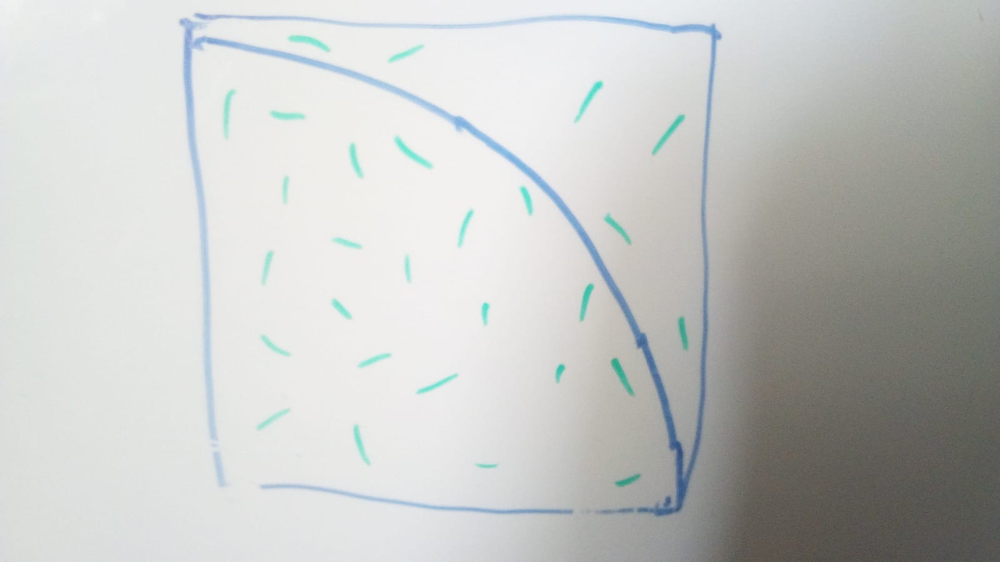

<!-- BEGIN TITLE -->
# How to calculate Pi with rice
<!-- END TITLE -->

<!-- BEGIN BODY -->
Draw a square and a quatercircle in it on a paper and throw a hand full of rice on it. Done!

Well almost done. Now you count how many grains of rice landed inside the square and how many landed inside the quatercircle.
The ratio of these two numbers is an approximation of the ratio of the two areas Pi*r^2/r^2=Pi/4.
Multiply the ratio by 4 and you get Pi, well an approximation. If you are not happy with the accuracy just use more rice.

This is one example for the Monte Carlo method. Key is to avoid computing a complicated formula by using random samples in a clever way.
<!-- END BODY -->

                         

## Optional text
<!-- BEGIN OPTIONAL -->

<!-- END OPTIONAL -->

## Author
<!-- BEGIN AUTHOR -->
Simon Dold
<!-- END AUTHOR -->
