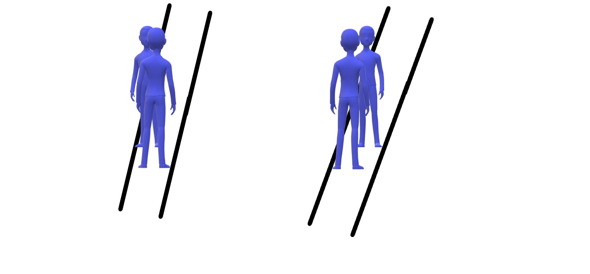

<!-- BEGIN TITLE -->
# Livelock
<!-- END TITLE -->

<!-- BEGIN BODY -->
Suppose there are two gentlemen in front of each other in a narrow pathway and would like to pass to the other side. The first is on the right side and asks the other to move to the left so he can pass. At the same time, the second who is on the left side asks the first to move to the right. They move from right to left and from left to right, and then the same situation happens again, and they cannot pass. So, they repeat their questions and keep swaying in the narrow path without passing. 

This situation could happen in operating systems and is called livelocks. Really!? Yes, suppose you have two running processes A and B, and each holds a resource R1 and R2 respectively. A requires R2 to complete its job and B requires R1 to complete its job. A requested R2 from B, and at the same time, B requested R1 from A. So, they swap their resources. Now, each process has again only one resource and requests the other one. They will keep exchanging the resources without doing the computation. 
<!-- END BODY -->

## Author
<!-- BEGIN AUTHOR -->
Omnia Kahla
<!-- END AUTHOR -->
