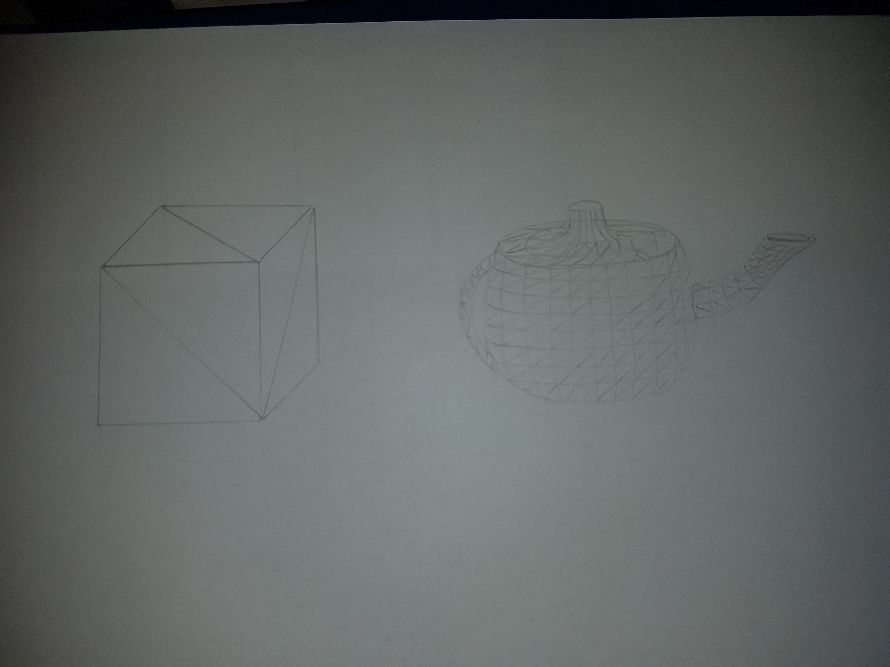

<!-- BEGIN TITLE -->
# World of triangles
<!-- END TITLE -->

<!-- BEGIN BODY -->
The pictures seen in computer animated films or computer games consist of many small triangles. The shape of a figure in such an image comprises many points. To visualize a surface a set of those points are connected by lines. The mathematical figure which emerges through this process is called polygon. The smallest polygon possible is the triangle, where only three points are connected. Furthermore, a triangle guarantees that all the points of the polygon are on the same plane.

The more triangles are used the more detailed a surface is. Where a simple object with flat surfaces like a cube can be modeled by using only a few triangles, for a more complex structure like a teapot, many more triangles are required to represent its round shape.

<!-- END BODY -->

## Optional text
<!-- BEGIN OPTIONAL -->

<!-- END OPTIONAL -->

## Author
<!-- BEGIN AUTHOR -->
Rebecca Dold
<!-- END AUTHOR -->
