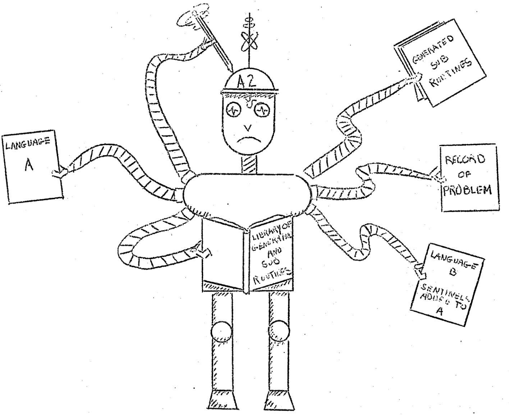

<!-- BEGIN TITLE -->
# Machines within Machines: Compilers
<!-- END TITLE -->

<!-- BEGIN BODY -->
In 1954, computers just computed numbers. Grace Hopper, a famous
female programmer around then, had a hard time to convince her
colleagues that these machines can do more.

The picture is hers and shows how a computer program can translate
one computer program into another one. She even coined the term that is still use
today: a **compiler**.

Nowadays we have many more of these translation and transformation
machines, with names as funny as the picture: _cross-compilers_,
_transpilers_ and _compiler-compilers_ (cocos). Their mission is to
translate from one computer language to another, for example a C
program to machine code. But they can also be used to "transpile"
from a new version of a programming to the old one, like e.g.,
JavaScript6 to JavaScript5.
<!-- END BODY -->

## Optional text
<!-- BEGIN OPTIONAL -->
[Seminar notes 1954: http://www.textfiles.com/bitsavers/pdf/mit/summer_session_1954/Digital_Computers_Advanced_Coding_Techniques_Summer_1954.pdf](http://www.textfiles.com/bitsavers/pdf/mit/summer_session_1954/Digital_Computers_Advanced_Coding_Techniques_Summer_1954.pdf)
<!-- END OPTIONAL -->

## Author
<!-- BEGIN AUTHOR -->
cft
<!-- END AUTHOR -->
