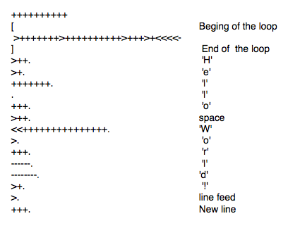

<!-- BEGIN TITLE -->
# Esoteric Science
<!-- END TITLE -->

<!-- BEGIN BODY -->
There are thousands of programming languages. But some of them are just laborious and inefficient. They are not designed for practical usage but to train different aspects of for example software engineering. Those programming languages are called esoteric. One of them is called Brainfuck. It consists of the eight language commands:

<  > + -  . , [ ]

It is possible to write programs with this language the question solely is if one wants to.
<!-- END BODY -->

## Optional text
<!-- BEGIN OPTIONAL -->
<!-- END OPTIONAL -->

## Author
<!-- BEGIN AUTHOR -->
Rebecca Dold
<!-- END AUTHOR -->
