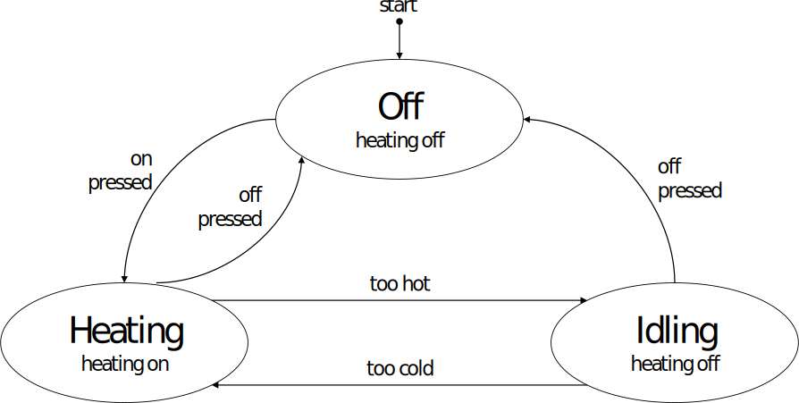

<!-- BEGIN TITLE -->
# Think about the different states of your system
<!-- END TITLE -->

<!-- BEGIN BODY -->
A state machine is a system which defines its current status through a set of states. The graphic shows the state machine of an oven. When the power is switched on, the oven starts in the off state. The state diagram of the oven has three states: off, heating and idling. The arrows between the states symbolize the possible transitions between them. 

In a state machine, the current state determines what the system is doing. In case of the example, this means whether the heating element is activated or not. The transition between the states happens based on events. These events can be triggered by external factors like a button pressed by the user or a sensor reading but can also be internal like the result of a computation.

State machines are a concise way of describing systems with clearly distinguishable phases or states. The concept of state machines were developed in the context of computer systems but is now also used by engineers from other disciplines.
<!-- END BODY -->

## Author
<!-- BEGIN AUTHOR -->
Marco Vogt
<!-- END AUTHOR -->