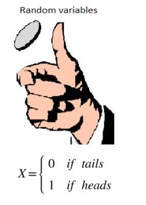

<!-- BEGIN TITLE -->
# Random Variables
<!-- END TITLE -->

<!-- BEGIN BODY -->
A random variable quantifies the outcomes of a random process.
What is a random process? 
A random process is a process that could have different outputs, such as flipping a coin or rolling a dice. To be able to do some mathematics on these outcomes, we need to define a value for each of these outcomes. For instance, according to our example, we could check the probability of X is head by calculating P(X=1). 

Random variables are different from the variables used in Algebra, as it could have different values. There are many methods that are based on the random variables, such as the Monte Carlo simulations and probability density function. 
<!-- END BODY -->

## Author
<!-- BEGIN AUTHOR -->
Omnia Kahla
<!-- END AUTHOR -->
