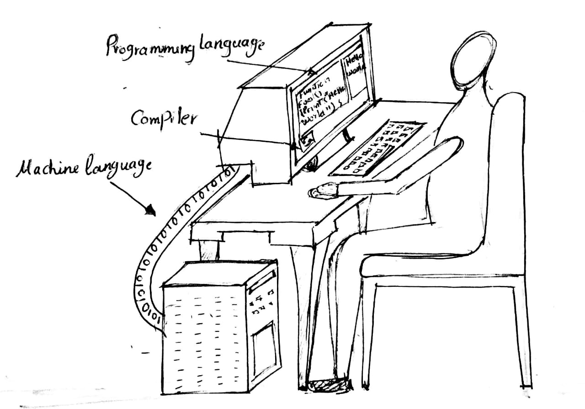

<!-- BEGIN TITLE -->
# Machine Language vs. Programming Language
<!-- END TITLE -->

<!-- BEGIN BODY -->
A programming language is a language that programmers use to develop applications. It is also called high-level language as they are more human readable.  Examples of such programming language include -but not limited to- C++, Java, and Fortran.

On the other hand, machine language is a low-level language, because the computer can understand and process directly without any transformations. It is only one language which is a stream of 0's and 1's.

<!-- END BODY -->

## Author
<!-- BEGIN AUTHOR -->
Omnia Kahla
<!-- END AUTHOR -->
